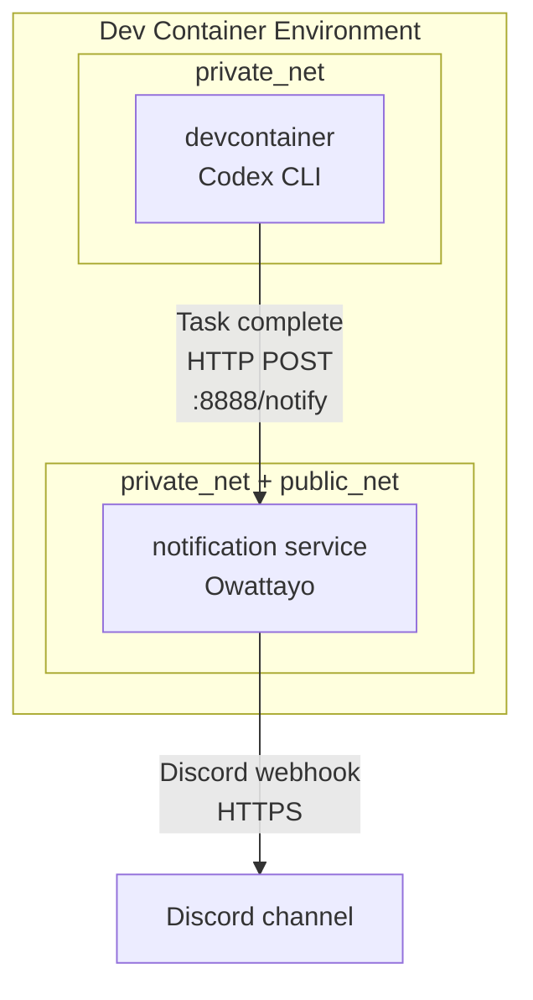

# Codex in Dev Container example

> [!NOTE]
> For readers coming from “[Built a Dev Container to run Claude Code as safely as possible](https://zenn.dev/backpaper0/articles/038838c4cec2a8)”.
> Development has continued since the article, so the repository no longer matches it.
> To see the state at the time of writing, check the [`zenn/2025-08-19` tag](https://github.com/backpaper0/claude-code-in-devcontainer-example/tree/zenn/2025-08-19).

## Overview

This project provides a reference setup for running the OpenAI Codex CLI safely inside a Dev Container. It adapts a configuration originally built for Claude Code to Codex.

Network filtering is enforced by a whitelist-driven Squid proxy so only approved domains are reachable.

## Components

- **Dev Container**: Runs Codex CLI inside VS Code Dev Containers
- **Proxy**: Squid proxy with whitelist-based filtering
- **Notification**: Owattayo-based job completion notification service
- **Docker Compose**: Integrates three services (devcontainer, proxy, notification)

## Architecture

Docker Compose runs three services with network separation for security.

```
┌─────────────────────────────────────────────────┐
│ Dev Container Environment                        │
│                                                  │
│  private_net (internal)                           │
│  ┌──────────────┐      ┌─────────────────────┐ │
│  │ devcontainer │◄────►│  notification       │ │
│  │ (Codex CLI)  │      │  (Owattayo)         │ │
│  └──────┬───────┘      └─────────┬───────────┘ │
│         │                        │             │
│    ┌────▼────┐                   │             │
│    │  proxy  │                   │             │
│    │ (Squid) │                   │             │
│    └────┬────┘                   │             │
│         │                        │             │
│  ───────┼────────────────────────┼─────────────│
│  public_net (external)            │             │
│         │                        │             │
└─────────┼────────────────────────┼─────────────┘
          │                        │
          ▼                        ▼
    Internet (whitelist)     Internet (Discord)
```

- **private_net**: Internal-only network (no direct internet access)
- **public_net**: Internet-facing network
- **devcontainer**: Attached only to private_net; reaches the internet via proxy (whitelisted)
- **proxy**: Connected to both networks; enforces whitelist-based filtering
- **notification**: Connected to both networks; receives notifications from devcontainer and forwards to Discord

## Directory layout

```
.devcontainer/
├── devcontainer.json          # Dev Container settings
├── compose.yaml               # Docker Compose (three services)
├── install-codex.sh           # Codex CLI install script
├── update-workspace-owner.sh  # Workspace ownership helper
└── proxy/
    ├── squid.conf             # Squid proxy config
    └── whitelist.txt          # Allowed domains list
```

## Features

### 1. Codex CLI integration

- Install Codex CLI via npm (`@openai/codex`)
- Use the official Microsoft Python 3.13 base image (`mcr.microsoft.com/devcontainers/python:3.13`)
- Use DevContainers Python/Node features
  - Python: includes uv and pre-commit tooling
  - Node.js: installs Codex via npm

### 2. Proxy-based network filtering

- Whitelist-based access control using Squid
- Domain allowlist managed in `.devcontainer/proxy/whitelist.txt`
- Allowed services/domains include:
  - **GitHub**: `.github.com`
  - **VS Code**: update, marketplace, sync-related domains
  - **Dev tooling**: npm registry, PyPI
  - **AI**: OpenAI API
- Network separation:
  - devcontainer is attached only to private_net (no direct internet)
  - All HTTP/HTTPS traffic goes through the proxy
  - `no_proxy` permits direct access to internal services (localhost, proxy, notification)

### 3. Development environment setup

- VS Code Python extension (ms-python.python)
- Ruff formatter/linter
- YAML extension (redhat.vscode-yaml)
- Automatic Python virtualenv (`.venv`)
- `UV_LINK_MODE=copy` for dependency management efficiency

### 4. Notification system (Owattayo)

- Forwards HTTP requests to Discord as notifications
- Used for Codex task completion alerts
- Uses the `ghcr.io/backpaper0/owattayo` container image
- Configured with a Discord webhook URL via `DISCORD_WEBHOOK_URL`
- Connected to both private_net and public_net to receive from devcontainer and send to Discord

### 5. Workspace ownership management

- Ensures correct file ownership inside the container
- Manages workspace ownership as the `vscode` user
- Keeps file operations smooth during development
- Runs automatically via postStartCommand (`.devcontainer/update-workspace-owner.sh`)

## Notification architecture

### Notification service (Owattayo)

Owattayo is a lightweight relay that forwards completion notifications.

**Flow:**



**Highlights:**

- Forwards HTTP payloads to Discord
- Focused on task/completion notifications
- Works alongside other services via Docker Compose
- Configured via environment variable (`DISCORD_WEBHOOK_URL`)
- Connected to both private_net and public_net to receive internally and send externally

**Setup:**

1. Obtain a Discord webhook URL
2. Set `DISCORD_WEBHOOK_URL` (set on the host to propagate into the container)
3. The notification service starts automatically via Docker Compose

## How to build

### Prerequisites

- Docker Desktop or Docker Engine
- VS Code with Dev Containers extension
- Git

### Steps

1. **Clone the repository**

   ```bash
   git clone <repository-url>
   cd <project-directory>
   ```

2. **Set environment variables (optional)**

   If you want Discord notifications, set `DISCORD_WEBHOOK_URL` on the host:

   ```bash
   export DISCORD_WEBHOOK_URL="https://discord.com/api/webhooks/YOUR_WEBHOOK_URL"
   ```

3. **Start the Dev Container**

   - Open the project in VS Code
   - Open the command palette (Ctrl+Shift+P / Cmd+Shift+P)
   - Run “Dev Containers: Reopen in Container”

4. **Automatic setup**

   - Uses the official Microsoft Python 3.13 base image
   - Docker Compose brings up three services (devcontainer, proxy, notification)
   - Python and Node.js environments are provisioned
   - Codex CLI is installed via npm (via `postCreateCommand`)
   - Squid proxy starts automatically with whitelist-based filtering enabled

5. **Verify operation**

   ```bash
   # Check Codex CLI
   codex --version

   # Access allowed site through proxy
   curl --connect-timeout 5 https://api.github.com/zen  # should succeed

   # Confirm proxy blocks disallowed site
   curl --connect-timeout 5 https://example.com  # should fail
   ```

### Environment variables

Set as needed:

- `DISCORD_WEBHOOK_URL`: For Discord notifications (set on host; passed into notification container)

### Tests

To confirm the proxy whitelist is ready for Codex, run at repo root:

```bash
./examples/test_codex_whitelist.sh
```

## Customization

### Add domains to the proxy whitelist

Append a domain to `.devcontainer/proxy/whitelist.txt`:

```bash
echo "example.org" >> .devcontainer/proxy/whitelist.txt
```

One domain per line. Wildcards are not supported; specify exact domains.

**Note**: Rebuild the Dev Container after changing the whitelist.

### Customize proxy settings

For advanced needs, edit `.devcontainer/proxy/squid.conf`. Standard Squid options apply.

## Codex configuration

Codex behavior is controlled by files under `$CODEX_HOME` (default: `~/.codex`). This Dev Container sets `CODEX_HOME=/home/vscode/.codex` and mounts it for persistence.

### Example config.json

```json
{
  "model": "o4-mini",
  "approvalMode": "suggest",
  "fullAutoErrorMode": "ask-user",
  "notify": true
}
```

Codex follows the official configuration formats; TOML/JSON/YAML are accepted. Authentication is expected via the Codex CLI login flow, so API keys do not need to be passed via environment variables.

## Security notes

This project aims to provide a relatively safe environment for running Codex CLI, but it does not guarantee complete security.

- Only domains on the whitelist are reachable
- Manage the proxy config carefully; avoid adding unnecessary domains
- Be cautious about commands executed by Codex
- Be extra careful when working with sensitive projects

## Troubleshooting

### Cannot access via proxy

1. Ensure required domains are listed in `.devcontainer/proxy/whitelist.txt`
2. Rebuild the Dev Container
3. Check the proxy service is up: `docker compose -f .devcontainer/compose.yaml ps`

### Notifications not delivered

1. Verify `DISCORD_WEBHOOK_URL` is set correctly
2. Confirm the notification service is running
3. Confirm the notification service is attached to public_net

## License

This project is released under the MIT License.
