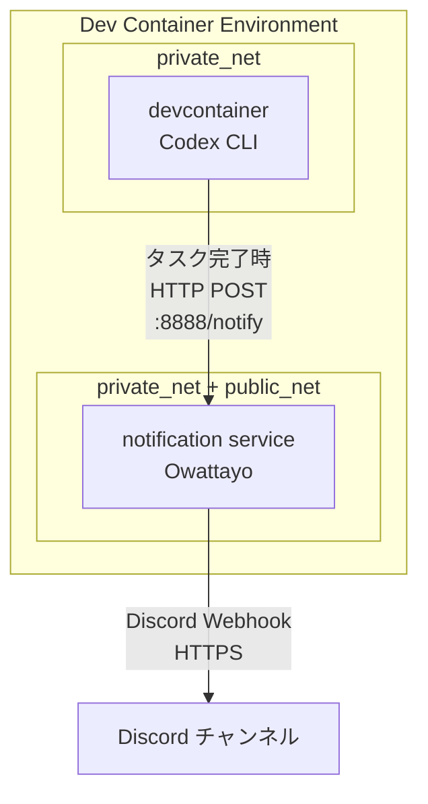

# Codex in Dev Container example

> [!NOTE]
> 「[Claude Codeをなるべく安全に動かすためのDev Containerを構築した](https://zenn.dev/backpaper0/articles/038838c4cec2a8)」からこのリポジトリを訪れた方へ。
> 記事を書いてからも開発を進めているため、本リポジトリの内容は記事の内容と乖離していると思います。
> 記事執筆時点の本リポジトリがどのような状態だったか見たい場合は[`zenn/2025-08-19`タグ](https://github.com/backpaper0/claude-code-in-devcontainer-example/tree/zenn/2025-08-19)をご覧ください。

## 概要

このプロジェクトは、OpenAI Codex CLIをDev Container環境で安全に動作させるための構成例を提供します。もともとClaude Code向けに組んでいた構成をCodex用に置き換えています。

ネットワークフィルタリングにはSquid Proxyを使用したホワイトリスト方式を採用し、許可されたドメインのみへのアクセスを実現しています。

## 構成要素

- **Dev Container**: VS Code Dev Container環境でCodex CLIを実行
- **Proxy**: Squid Proxyによるホワイトリストベースのネットワークフィルタリング
- **Notification**: Owattayoによる作業完了通知サービス
- **Docker Compose**: 3つのサービス（devcontainer、proxy、notification）を統合

## アーキテクチャ

Docker Composeで3つのサービスを実行し、ネットワークを分離することでセキュリティを確保しています。

```
┌─────────────────────────────────────────────────┐
│ Dev Container Environment                        │
│                                                  │
│  private_net (内部ネットワーク)                    │
│  ┌──────────────┐      ┌─────────────────────┐ │
│  │ devcontainer │◄────►│  notification       │ │
│  │ (Codex CLI)  │      │  (Owattayo)         │ │
│  └──────┬───────┘      └─────────┬───────────┘ │
│         │                        │             │
│    ┌────▼────┐                   │             │
│    │  proxy  │                   │             │
│    │ (Squid) │                   │             │
│    └────┬────┘                   │             │
│         │                        │             │
│  ───────┼────────────────────────┼─────────────│
│  public_net (外部接続ネットワーク)  │             │
│         │                        │             │
└─────────┼────────────────────────┼─────────────┘
          │                        │
          ▼                        ▼
    Internet (whitelist)     Internet (Discord)
```

- **private_net**: 内部専用ネットワーク（インターネットアクセス不可）
- **public_net**: 外部接続可能ネットワーク
- **devcontainer**: private_netのみに接続し、proxy経由でインターネットアクセス（ホワイトリストのみ）
- **proxy**: 両方のネットワークに接続し、ホワイトリストベースのフィルタリングを提供
- **notification**: 両方のネットワークに接続し、devcontainerからの通知を受信してDiscordへ直接送信

## ディレクトリ構造

```
.devcontainer/
├── devcontainer.json          # Dev Container設定ファイル
├── compose.yaml               # Docker Compose設定（3サービス構成）
├── install-codex.sh           # Codex CLIインストールスクリプト
├── update-workspace-owner.sh  # ワークスペース所有者設定スクリプト
└── proxy/
    ├── squid.conf             # Squid Proxy設定
    └── whitelist.txt          # 許可ドメインリスト
```

## 機能

### 1. Codex CLI統合

- npm経由でCodex CLIをインストール（`@openai/codex`）
- Microsoft公式のPython 3.13ベースイメージ（`mcr.microsoft.com/devcontainers/python:3.13`）を使用
- DevContainersのPython/Nodeフィーチャーを使用
  - Python: uv、pre-commitツールを含む
  - Node.js: npm経由でCodexをインストール

### 2. プロキシベースのネットワークフィルタリング

- Squid Proxyを使用したホワイトリストベースのアクセス制御
- ドメインベースの許可リスト管理（`.devcontainer/proxy/whitelist.txt`）
- 許可されたサービスとドメイン:
  - **GitHub**: `.github.com`
  - **VS Code**: 更新、マーケットプレイス、同期サービス各種ドメイン
  - **開発ツール**: npm registry, PyPI
  - **AI**: OpenAI API
- ネットワーク分離:
  - devcontainerはprivate_netのみに接続（インターネット直接アクセス不可）
  - すべてのHTTP/HTTPS通信はproxy経由で実行
  - `no_proxy`設定により内部サービス（localhost、proxy、notification）への直接アクセスを許可

### 3. 開発環境設定

- Python用VS Code拡張機能（ms-python.python）
- Ruff（フォーマッター・リンター）
- YAML拡張機能（redhat.vscode-yaml）
- Python仮想環境の自動設定（`.venv`）
- UV_LINK_MODE=copy設定による依存関係管理の最適化

### 4. 通知システム（Owattayo）

- HTTPリクエストを受信してDiscordに転送する通知サービス
- Codexのタスク完了時などの作業通知に使用
- `ghcr.io/backpaper0/owattayo`コンテナイメージを使用
- Discord Webhook URLによる通知設定（環境変数`DISCORD_WEBHOOK_URL`）
- private_netとpublic_netの両方に接続し、devcontainerからの通知を受信してDiscordに転送

### 5. ワークスペース所有者管理

- コンテナ内でのファイル権限とワークスペース所有者を適切に設定
- vscodeユーザーとしてワークスペースの所有権を管理
- 開発時のファイル操作を円滑にするための権限設定
- postStartCommandで自動実行（`.devcontainer/update-workspace-owner.sh`）

## 通知アーキテクチャ

### Notificationサービス（Owattayo）

Owattayoは作業完了通知を目的とした軽量な通知転送サービスです。

**動作フロー:**



**特徴:**

- HTTPリクエストの内容をDiscordに転送
- 作業完了やタスク終了の通知に特化
- Docker Composeによる他サービスとの連携
- 環境変数による設定（`DISCORD_WEBHOOK_URL`）
- private_netとpublic_netの両方に接続し、内部からの通知を受信して外部へ転送

**設定方法:**

1. Discord ServerでWebhook URLを取得
2. 環境変数`DISCORD_WEBHOOK_URL`に設定（ホスト環境で設定すると自動的にコンテナへ引き継がれる）
3. Docker Composeでnotificationサービスが自動起動

## 構築手順

### 前提条件

- Docker Desktop または Docker Engine
- VS Code with Dev Containers extension
- Git

### 手順

1. **リポジトリのクローン**

   ```bash
   git clone <repository-url>
   cd <project-directory>
   ```

2. **環境変数の設定（オプション）**

   Discord通知を使用する場合は、ホスト環境で`DISCORD_WEBHOOK_URL`を設定します：

   ```bash
   export DISCORD_WEBHOOK_URL="https://discord.com/api/webhooks/YOUR_WEBHOOK_URL"
   ```

3. **Dev Containerの起動**
   - VS Codeでプロジェクトを開く
   - コマンドパレット（Ctrl+Shift+P / Cmd+Shift+P）を開く
   - "Dev Containers: Reopen in Container"を実行

4. **自動セットアップ**
   - Microsoft公式のPython 3.13ベースイメージが使用されます
   - Docker Composeで3つのサービス（devcontainer、proxy、notification）が起動します
   - Python環境、Node.js環境がセットアップされます
   - Codex CLIがnpm経由でインストールされます（`postCreateCommand`により実行）
   - Squid Proxyが自動で起動し、ホワイトリストベースのネットワークフィルタリングが有効になります

5. **動作確認**

   ```bash
   # Codex CLIの動作確認
   codex --version

   # プロキシ経由のアクセス確認（許可されたサイト）
   curl --connect-timeout 5 https://api.github.com/zen  # 成功するはず

   # プロキシによるブロック確認（許可されていないサイト）
   curl --connect-timeout 5 https://example.com  # エラーになるはず
   ```

### 環境変数

必要に応じて以下の環境変数を設定してください：

- `DISCORD_WEBHOOK_URL`: Discord通知用（ホスト側で設定するとnotificationサービスのコンテナへも自動で引き継がれます）

### テスト

プロキシのホワイトリストがCodex用に設定されているかを確認するには、リポジトリルートで次を実行します:

```bash
./examples/test_codex_whitelist.sh
```

## カスタマイズ

### プロキシのホワイトリストドメイン追加

`.devcontainer/proxy/whitelist.txt`に新しいドメインを追加します：

```bash
echo "example.org" >> .devcontainer/proxy/whitelist.txt
```

ドメインは1行に1つ記述します。ワイルドカードは使用できず、完全一致のドメイン名を指定します。

**注意**: ホワイトリストを変更した後は、Dev Containerを再構築（Rebuild Container）する必要があります。

### プロキシ設定のカスタマイズ

より高度な設定が必要な場合は、`.devcontainer/proxy/squid.conf`を編集します。Squid Proxyの標準的な設定オプションを使用できます。

## Codex設定

Codexは`$CODEX_HOME`（デフォルト: `~/.codex`）配下の設定ファイルで挙動を制御します。このDev Containerでは`CODEX_HOME=/home/vscode/.codex`を設定し、ボリュームをマウントして永続化しています。

### config.json例

```json
{
  "model": "o4-mini",
  "approvalMode": "suggest",
  "fullAutoErrorMode": "ask-user",
  "notify": true
}
```

Codexの設定フォーマットは公式ドキュメントに従い、TOML/JSON/YAMLいずれでも配置できます。認証はCodex CLIのログインフローを利用する想定で、環境変数でAPIキーを渡す必要はありません。

## セキュリティに関する注意事項

このプロジェクトは、Codex CLIを比較的安全に実行するための環境を提供しますが、完全なセキュリティを保証するものではありません。

- ホワイトリストに含まれるドメインへのアクセスは許可されます
- プロキシ設定を慎重に管理し、不要なドメインをホワイトリストに追加しないでください
- Codexが実行するコマンドには十分注意してください
- 機密情報を含むプロジェクトでの使用には特に注意が必要です

## トラブルシューティング

### プロキシ経由でアクセスできない

1. `.devcontainer/proxy/whitelist.txt`に必要なドメインが含まれているか確認
2. Dev Containerを再構築（Rebuild Container）
3. プロキシサービスが正常に起動しているか確認: `docker compose -f .devcontainer/compose.yaml ps`

### 通知が届かない

1. `DISCORD_WEBHOOK_URL`が正しく設定されているか確認
2. notificationサービスが正常に起動しているか確認
3. notificationサービスがpublic_netに接続されているか確認

## ライセンス

このプロジェクトはMITライセンスの下で公開されています。
